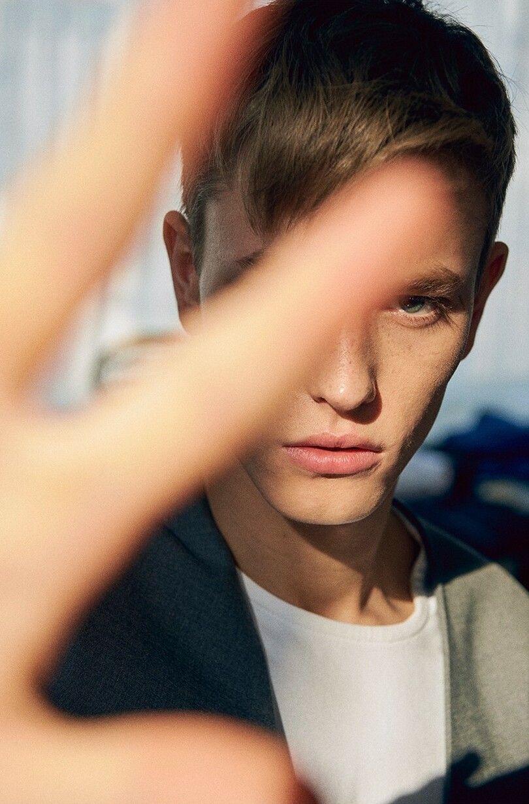
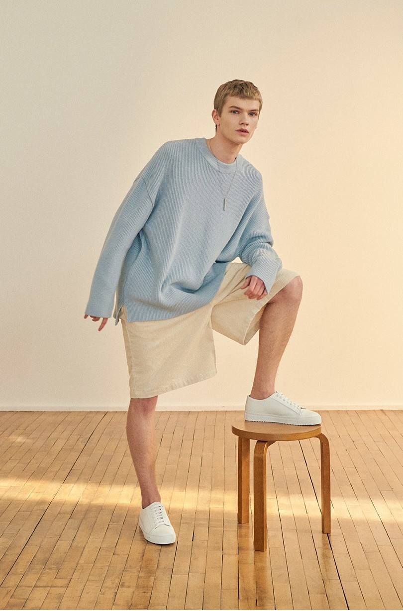
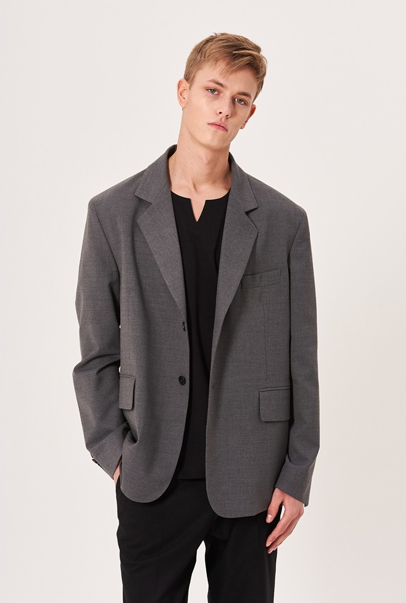
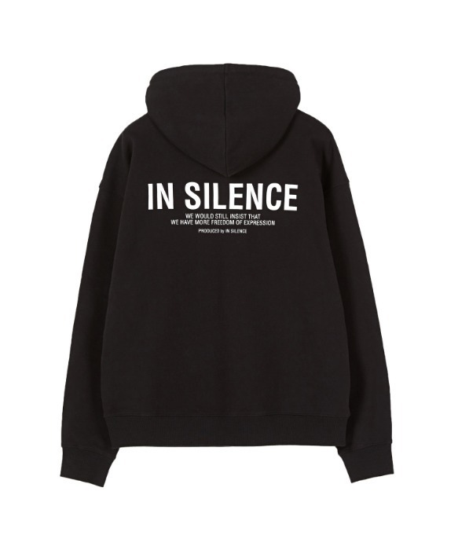
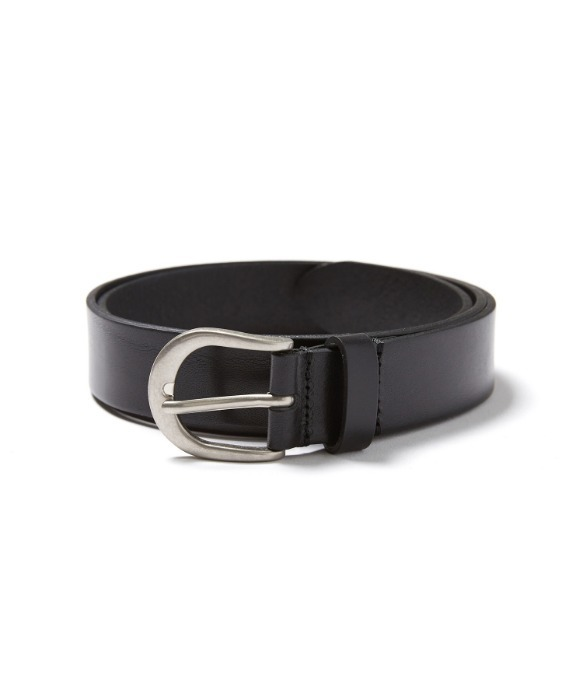
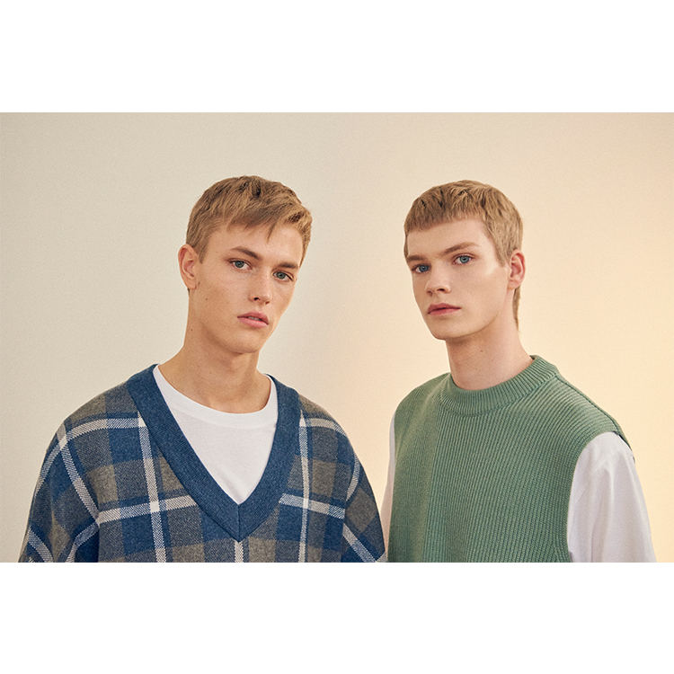
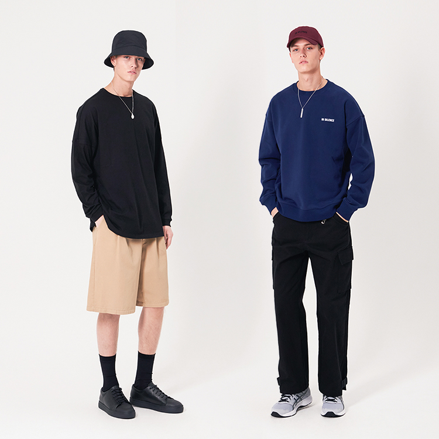
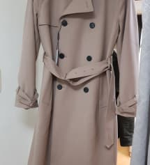

# 쇼핑몰(인사일런스) 클론 코딩

http://insilence.co.kr

레이아웃을 맞춰본다.

## ch1


위의 이미지를 보면 맨 위의 네비게이션과 하단의 회색 정보란을 제외하면 4개의 단락으로 구성되 있는 것을 볼 수 있다.
이것을 임의로 main, best, article, review로 분류하겠다.

그래소 일단 4개를 분리시켜주자

```html
<body>
  <div class="main"></div>
  <div class="best"></div>
  <div class="article"></div>
  <div class="review"></div>
</body>
```

하지만 그리고 레이아웃을 관리하기 편하게 그 안에 container라는 div를 만들어주자.  
main-container나 best-container는 그 안에서만 관리하기 위함이고  
container는 포괄적인 스타일을 적용시키기 위함이다.  
방법은 다양하지만 개인적으로 선호하는 방법을 사용했다.

```html
<div class="main">
  <div class="main-container container"></div>
</div>
<div class="best">
  <div class="best-container container"></div>
</div>
<div class="article">
  <div class="article-container container"></div>
</div>
<div class="review">
  <div class="article-container container"></div>
</div>
```

그 다음은 이미지를 사진에 있는 이미지 숫자대로 이미지를 넣어주자.

```html
<div class="main">
  <div class="main-container container">
    
    
    
  </div>
</div>
<div class="best">
  <div class="best-container container">
    
    ....
    
  </div>
</div>
<div class="article">
  <div class="article-container container">
    
    ...
    
  </div>
</div>
<div class="review">
  <div class="article-container container">
    
    ...
    
  </div>
</div>
```
그 다음 css로 레이아웃을 만들어보자